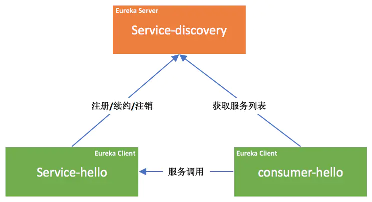

# 1 概述

从结构图上可以看出有一下我们所构建的工程中有三种角色：
* Eureka Server: 服务注册中心，负责服务列表的注册、维护和查询等功能；
* Service Provider: 服务提供方，同时也是一个`eureka client`，负责将所提供的服务
向`eureka server`进行注册、续约和注销等操作。注册时所提供的主要数据包括服务名、机器
ip、端口号、域名等，从而能够使服务消费方能够找到；
* Service Consumer: 服务消费方，同时也是一个`eureka client`，同样也会向`eureka
server`中获取相应的服务列表，以便能够发起服务调用。

> 服务提供方和服务消费方并不是一个严格的概念，往往服务消费方也是一个服务提供方，同时
> 服务提供方也可能会调用其他服务方所提供的服务。当然在我们进行微服务构建时还是需要
> 遵守业务层级之间的划分，尽量避免服务之间的循环依赖。

# 2 构建Eureka Server
## 2.1 依赖
```xml
<dependencies>
  <dependency>
    <groupId>org.springframework.cloud</groupId>
    <artifactId>spring-cloud-starter-netflix-eureka-server</artifactId>
  </dependency>
</dependencies>
```

## 2.2 启动类
```java
@EnableEurekaServer
@SpringBootApplication
public class Application {

    public static void main(String[] args) {
        new SpringApplicationBuilder(Application.class).web(true).run(args);
    }

}
```
> **说明**：这里核心就是在启动类上添加`@EnableEurekaServer`，声明这是一个Eureka服务器。

## 2.3 配置
```yaml
eureka:
  instance:
    hostname: localhost
  client:
    register-with-eureka: false
    fetch-registry: false
    service-url:
      defaultZone: http://${eureka.instance.name}:${server.port}/eureka
```


